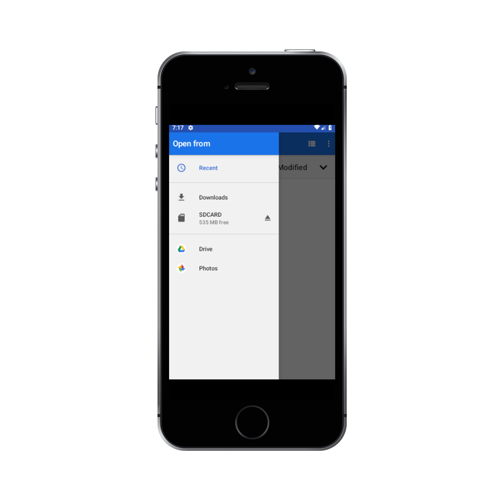

# MAKING AN INTERACTIVE ANDROID APPLICATION IN THE THEME OF ARTWORKS WHERE USERS CAN GET INFORMATION ABOUT ARTWORKS

* Artino is a user-friendly mobile application which is designed and developed to get information about previous artworks done 
  and it's capable of adding some new photos or images.
  
  Creation of app by android studio and used firebase as the database.
  
  
##  User Manual 

* Initially, the user will see an interface  and by clicking images button user may navigate to the 2nd interface of the app.   

* Then in the 2nd interface user can type the title and description from choose image user can add the relevant image and post it. 
  The user also can update it or delete it. Then after posting user can see previous artworks and their title and description by sliding.

* Then in 3rd interface user also can add image artwork or photo from choose file and browse from the phone storage and add it and upload it. The user also can view the uploads by   sliding over the phone.

## Application Screenshots

